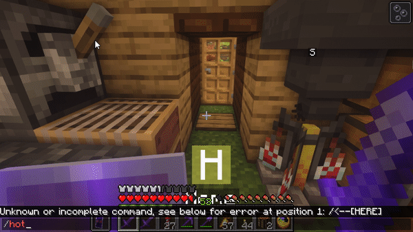

# hot-switcher
Minecraft mod for enabling hotbar swapping. 
See https://www.curseforge.com/minecraft/mc-mods/hotswitcher

HotSwitcher is a minecraft mod that enables cycling the hotbar items with the items in inventory. It provides more convenient access to more of the items a player is carrying. It is compatible with vanilla Minecraft.

## HotSwitcher

**Requires Forge**

HotSwitcher adds keybinds that allow you to cycle your hotbar with your inventory rows. This makes it more convenient to access the other items you have in your inventory by swapping them onto the hotbar without having to open your inventory and manual move them to the hotbar. The addon is only required client side, and is compatible with Vanilla and Realms. There could be compatibility issues with other mods, specifically those that involve changing the inventory, or adding/changing containers.

Usage

Default keybindings:

R - Cycle hotbar
Alt-R - Cycle hotbar reverse
G - Cycle active slot
Alt-G - Cycle active slot reverse
Configuration

Keybindings can be setup on the normal keybindings screen under the hotswitcher section. You can access the configuration by entering /hotswitcher into chat (it will show "Unknown or incomplete command" on a server), or binding a key to open the screen.

There are keybindings to cycle the hotbar with the inventory rows in forward or reverse order. There are also keybindings to cycle only the active hotbar slot, instead of the entire hotbar (in forward or reverse).

The number of rows that are cycled with the hotbar cycle key and slot cycle key can both be configured (defaults to 3 and 1 respectively).
